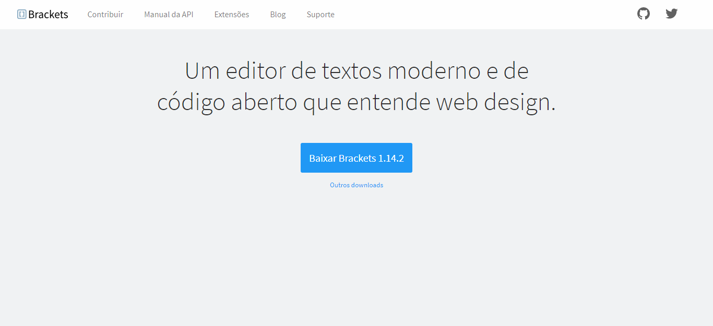

# Brackets Landing Page UI Clone

---

## Tabela de Conteúdo

- [:closed_book: Sobre](#closed_book-sobre)
- [:hammer_and_pick: Tecnologias Utilizadas](#hammer_and_pick-tecnologias-utilizadas)
- [:pushpin: A Ser Adicionado](#pushpin-a-ser-adicionado)
- [:handshake: Seja um Contribuidor](#handshake-seja-um-contribuidor)

---

## :closed_book: Sobre

Este projeto é um UI Clone da navbar da [landing page do Brackets Editor](http://brackets.io/), e um pouco da seção main do site.

---

## :hammer_and_pick: Tecnologias Utilizadas

Para desenvolver este projeto, utilizei as seguintes tecnologias:

- Visual Studio Code (Editor de código)
- HTML5
- CSS3
- JavaScript

---

## :heavy_check_mark: A Ser Adicionado

- [x] Responsividade para aparelhos de display menor que 625px

---

## :handshake: Seja um Contribuidor

Tem alguma ideia que poderia alavancar ainda mais o projeto, e deseja implementar? É simples!

1. Faça fork do projeto
2. Modifique o que achar necessário
3. Faça o commit das mudanças
4. Crie um Pull Request
